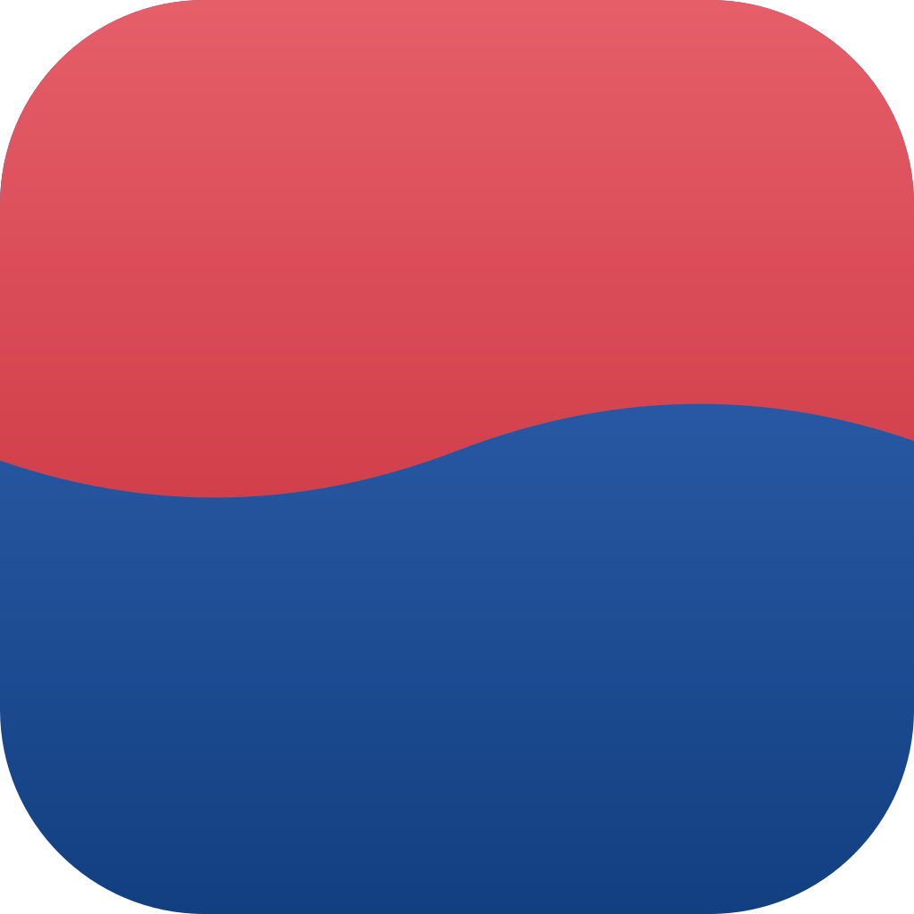

  
  <h1>K-portal</h1>
  
<b>한국형 로컬 AI 도구 허브</b> — 데스크톱 앱

---

**K-portal**은 비개발자도 MCP 플러그인을 원클릭으로 설치하면, 단일 게이트웨이가 Claude·ChatGPT·Codex 같은 AI 앱에 도구를 중계하는 한국형 로컬 AI 허브입니다. 내 문서·통계·법령을 내 컴퓨터 안에서 다루고, **오프라인 모드**를 켜면 아무것도 밖으로 나가지 않습니다.

이 저장소는 K-portal의 **공식 배포 채널**입니다. 설치 파일과 자동 업데이트 매니페스트(latest.json)만 제공하며, 소스 코드는 비공개입니다.

## 다운로드

| 플랫폼 | 파일 |
|---|---|
| macOS (Apple Silicon) | [k-portal-macos-arm64.dmg](https://github.com/seunghan91/k-portal-releases/releases/latest/download/k-portal-macos-arm64.dmg) |
| Windows (x64) | [k-portal-windows-x64-setup.exe (v0.1.1)](https://github.com/seunghan91/k-portal-releases/releases/download/v0.1.1/k-portal-windows-x64-setup.exe) — 최신(v0.1.4) Windows 빌드는 준비 중이며, 설치해 두면 자동 업데이트로 올라갑니다 |

최신 버전은 [Releases](https://github.com/seunghan91/k-portal-releases/releases) 페이지에서 확인할 수 있습니다.

## 설치

- **macOS (Apple Silicon)**: dmg를 열어 앱을 Applications에 끌어다 놓고, **첫 실행은 우클릭 → 열기**로 시작합니다.
- **Windows (64비트)**: setup.exe를 실행합니다(현재 v0.1.1 — 이후 버전은 자동 업데이트). 관리자 권한이 필요하지 않으며, WebView2 런타임(Windows 11과 최신 Windows 10에 기본 내장)만 있으면 됩니다.

설치 후에는 새 버전이 나오면 앱이 자동으로 알려주고, 설정 > 업데이트에서 직접 확인할 수도 있습니다.

## 무엇을 할 수 있나요

- **플러그인 스토어** — 한국어 문서 검색·KOSIS 통계·뉴스 키워드·법령 데이터팩 같은 MCP 플러그인을 원클릭 설치. Claude Code 스킬 번들도 제공합니다.
- **한 번 연결하면 전부 따라와요** — K-portal 자체가 하나의 MCP 서버라, Claude Desktop·Codex에 한 번만 연결해 두면 이후 설치한 플러그인 도구를 그 AI 앱에서 바로 쓸 수 있습니다.
- **내 문서 검색** — 한국어 형태소 색인 + 벡터 하이브리드 검색. HWP·PDF·Office 문서와 이미지(OCR)까지 내 컴퓨터 안에서 색인합니다.
- **로컬 AI 채팅** — Ollama 로컬 모델과 앱 안에서 대화. 대화 기록은 내 컴퓨터에만 남습니다.
- **할 일·캘린더·메모** — 로그인 없이도 전부 동작하는 로컬 우선 도구. AI에게 "내일 3시 미용실 예약 추가해줘"라고 말하면 그대로 등록됩니다.
- **오프라인 모드** — 켜면 클라우드 AI 대화와 외부 통신을 차단하고 로컬 AI만 사용합니다. 민감한 자료를 다룰 때를 위한 모드입니다.

## 문의

앱 안의 **설정 > 문의하기**에서 바로 보낼 수 있습니다.
